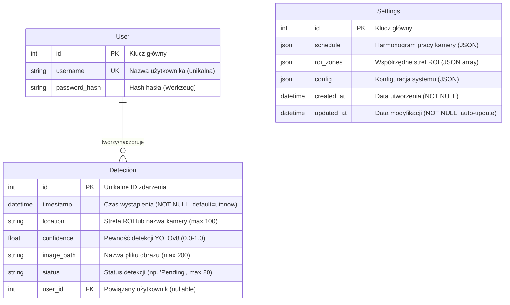
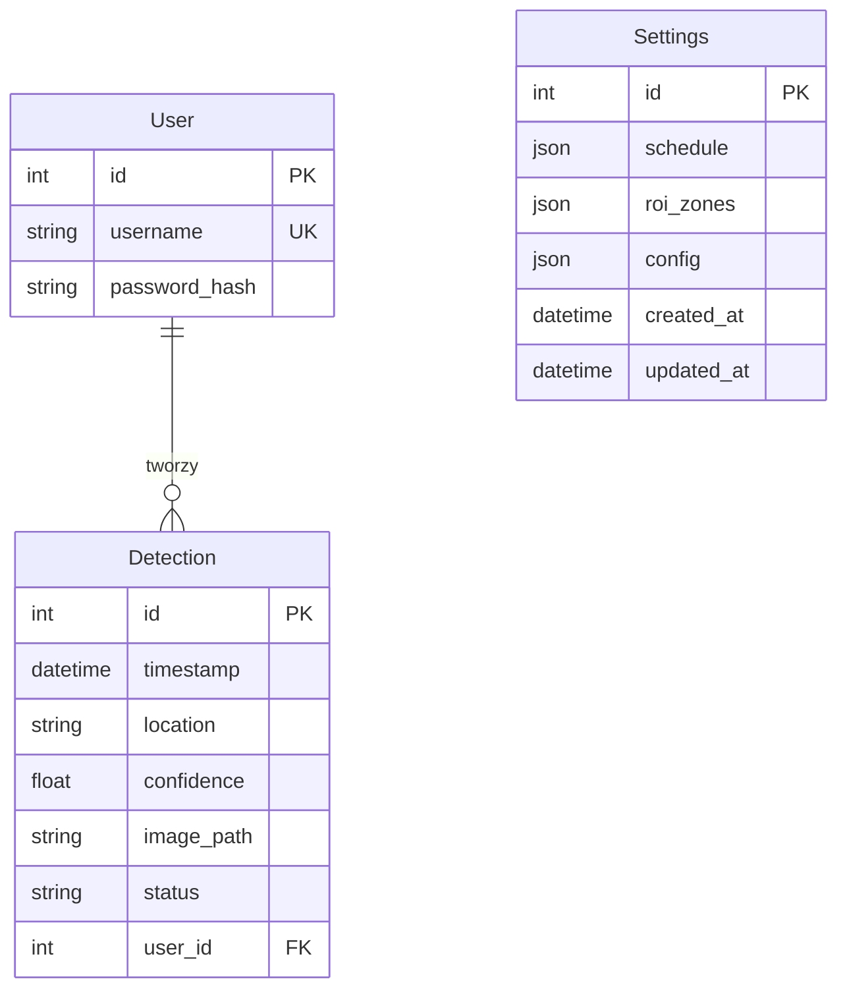

# INSTRUKCJA GENEROWANIA DIAGRAMU ERD

## ✅ Poprawiony kod Mermaid (zgodny z Twoim projektem)

### Wersja z pełnymi opisami (dla pracy inżynierskiej):



### Wersja uproszczona (czysta):



---

## 📋 INSTRUKCJA KROK PO KROKU

### Krok 1: Otwórz Mermaid Live Editor
Wejdź na: **https://mermaid.live/**

### Krok 2: Wklej kod
1. Skopiuj kod z powyższej sekcji (wybierz wersję z opisami lub uproszczoną)
2. Wklej go w lewym panelu edytora Mermaid

### Krok 3: Wyeksportuj jako PNG
1. Kliknij przycisk **"Actions"** (lub ikonę menu)
2. Wybierz **"Download PNG"** lub **"Download SVG"**
3. Zapisz plik jako `database_erd.png` (lub `.svg`)

### Alternatywnie: Eksport przez menu
- Kliknij prawym przyciskiem na diagram → "Save image as..."
- Lub użyj skrótu: Ctrl+S (Windows) / Cmd+S (Mac)

---

## ✅ WERYFIKACJA - Co zostało poprawione:

### ❌ Błędy w oryginalnym kodzie:
1. **Kolumna "role" w User** - NIE ISTNIEJE w kodzie! (usunięte)
2. **Brak kolumny "config" w Settings** - DODANE (w kodzie jest!)
3. **Brak kolumn "created_at" i "updated_at" w Settings** - DODANE

### ✅ Poprawki wprowadzone:
1. ✅ **User** - tylko 3 kolumny (id, username, password_hash)
2. ✅ **Detection** - wszystkie 7 kolumn zgodnie z kodem
3. ✅ **Settings** - wszystkie 6 kolumn (id, schedule, roi_zones, config, created_at, updated_at)
4. ✅ **Relacja** - User ||--o{ Detection (nullable=True oznacza 0 lub więcej)

---

## 📊 STRUKTURA TABEL - PEŁNA LISTA

### Tabela `User` (3 kolumny):
- `id` - Integer, Primary Key
- `username` - String(80), Unique, NOT NULL
- `password_hash` - String(255), NOT NULL

### Tabela `Detection` (7 kolumn):
- `id` - Integer, Primary Key
- `timestamp` - DateTime, NOT NULL, default=datetime.utcnow
- `location` - String(100), nullable
- `confidence` - Float, nullable
- `image_path` - String(200), nullable
- `status` - String(20), nullable
- `user_id` - Integer, Foreign Key (user.id), nullable

### Tabela `Settings` (6 kolumn):
- `id` - Integer, Primary Key
- `schedule` - JSON, NOT NULL, default=DEFAULT_SCHEDULE
- `roi_zones` - JSON, NOT NULL, default=[]
- `config` - JSON, NOT NULL, default={...}
- `created_at` - DateTime, NOT NULL, default=datetime.utcnow
- `updated_at` - DateTime, NOT NULL, default=datetime.utcnow, onupdate=datetime.utcnow

---

## 💡 UWAGI DLA ROZDZIAŁU 4.3

W sekcji 4.3 (Baza danych) możesz użyć następującego opisu:

> "System wykorzystuje bazę danych SQLite z trzema głównymi tabelami: `User` (zarządzanie użytkownikami), `Detection` (przechowywanie zdarzeń detekcji telefonów) oraz `Settings` (konfiguracja systemu). Tabela `Detection` zawiera 7 kolumn: identyfikator, znacznik czasu, lokalizację (strefa ROI lub kamera), poziom pewności detekcji, ścieżkę do obrazu, status oraz opcjonalne powiązanie z użytkownikiem. Relacja między tabelami `User` i `Detection` jest opcjonalna (nullable), co oznacza, że detekcja może istnieć bez przypisanego użytkownika."

---

## 🎨 OPCJONALNE: Dostosowanie wyglądu

Jeśli chcesz zmienić kolory lub style, możesz dodać na początku:

```mermaid
%%{init: {'theme':'base', 'themeVariables': { 'primaryColor':'#ff6b6b', 'primaryTextColor':'#fff', 'primaryBorderColor':'#7C0000', 'lineColor':'#F8B229', 'secondaryColor':'#006100', 'tertiaryColor':'#fff'}}}%%
erDiagram
    ...
```

---

**Pliki utworzone:**
- `database_erd_mermaid.txt` - Wersja z pełnymi opisami
- `database_erd_mermaid_simple.txt` - Wersja uproszczona
- `INSTRUKCJA_GENEROWANIA_ERD.md` - Ten plik z instrukcjami


